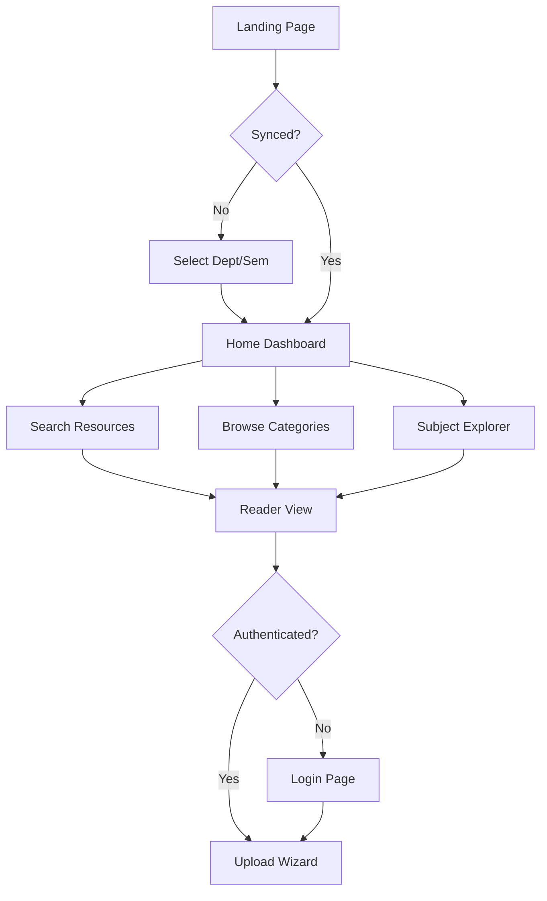

# RESO — Platform Features & Documentation

This document provides a detailed breakdown of every page, feature, and the technical implementation behind the RESO Academic Resource Hub.

---

## 🚀 Application Flow

1.  **Entry & Synchronization**: Upon landing on the **Home Page**, users are prompted to synchronize their academic profile (Department and Semester). This state is persisted in `localStorage` via Pinia (`useConfigStore`).
2.  **Navigation**: Once synced, the entire application tailors its content. Navigation is handled via the **Sidebar** or **Mobile Bottom Nav**.
3.  **Discovery**: Users find resources through **Browse**, **Subject Explorer**, **Question Papers**, or the **Global Search Bar**.
4.  **Consumption**: Clicking a resource opens the **Reader View**, allowing instant PDF viewing without downloads.
5.  **Contribution**: Authenticated users can access the **Upload Wizard** to share materials.
6.  **Authentication**: Users can login as **Student** or **Faculty** to unlock contribution features and personalized management.

---

## 📂 Page-by-Page Breakdown

### 1. Home Page (`/`)
*   **Feature**: Dashboard Overview.
*   **Functionality**: Displays the current synchronization status, total resource counts, and quick-access cards for main sections.
*   **Tech**: 
    - **WebGL Background**: Uses `DotGrid.vue` (powered by `OGL`) for an interactive, responsive background.
    - **GSAP Animations**: Hero text and cards use stagger animations on load.
    - **State**: Reactive binding to `configStore.dept` and `configStore.sem`.

### 2. Browse Page (`/browse`)
*   **Feature**: Multi-Category Resource Discovery.
*   **Functionality**: Organizes resources into tabs (Notes, Question Papers, Banks, etc.). Supports department-specific filtering.
*   **Tech**:
    - **Materialized Views**: Fetches data from highly optimized Supabase views.
    - **Query Sync**: Current category and filters are synced with URL query parameters for shareability.
    - **Tilt Effects**: `TiltCard.vue` provides subtle 3D hover effects.

### 3. Subject Explorer (`/explorer`)
*   **Feature**: Curriculum Hierarchy Navigator.
*   **Functionality**: Provides a tree-like navigation. Users select a Semester -> Subject to see all associated resources.
*   **Tech**:
    - **Dynamic Filtering**: Subjects are fetched based on the active `configStore` settings.
    - **Layout**: Uses a dual-column layout (Unit List | Resource View) for efficient browsing.

### 4. Question Papers (`/question-papers`)
*   **Feature**: Dedicated Exam Archive.
*   **Functionality**: Specialized view for past exam papers. Filters by Semester, Regulation (e.g., R22), and Exam Type (Mid-1, Mid-2, Semester End).
*   **Tech**:
    - **Zod Validation**: Backend strictly validates exam types and regulations.
    - **Metadata Indexing**: Resources are indexed with `exam_type` and `regulation` tags.

### 5. Academic Schedules (`/schedules`)
*   **Feature**: Chronology & Events.
*   **Functionality**: Lists academic calendars and schedules. Includes an "Upcoming Events" sidebar with a countdown-like UI.
*   **Tech**:
    - **Resource Type Filtering**: Specifically queries for `resource_type: 'calendar'`.
    - **Official Links**: Integrated uplink to the CBIT official records.

### 6. Syllabus Hub (`/syllabus`)
*   **Feature**: Course Content & Credits.
*   **Functionality**: Displays a list of subjects for the selected dept/sem. Shows credits and a detailed unit-by-unit breakdown in a modal.
*   **Tech**:
    - **JSON Data Integration**: Unit details are pulled from `parsed_syllabus.json` (extracted from the official R22 PDF).
    - **Modal UI**: Bespoke modal component with a timeline-style unit view.

### 7. Reader View (`/reader/:id`)
*   **Feature**: In-Browser PDF Consumption.
*   **Functionality**: A distraction-free environment for viewing documents. Shows uploader info, file size, and upload date.
*   **Tech**:
    - **Embedded Iframe**: Safely embeds Supabase Storage public URLs.
    - **Owner Actions**: If the uploader is the logged-in user, a "Delete" button appears.
    - **Soft Deletion**: Backend moves files to a `deleted` status instead of permanent destruction immediately. This is enforced via RLS to ensure only owners or admins can trigger it.

### 8. Upload Wizard (`/upload`)
*   **Feature**: Secure Community Contribution.
*   **Functionality**: A multi-step form for contributing files.
*   **Tech**:
    - **Deduplication**: Backend uses `SHA-256` hashing to detect duplicate files
    - **Anonymity Toggle**: Users can mask their identity; the backend sets `uploaded_by` but the public `name` becomes "Anonymous".
    - **Validation**: Limits files to 25MB and specific types (PDF, DOCX, PPTX).

### 9. Login Page (`/login`)
*   **Feature**: Identity Management.
*   **Functionality**: Separate paths for Students and Faculty.
*   **Tech**:
    - **Synthetic Auth**: Uses roll numbers/emails as identifiers. Passwords are department-specific for simplicity (standardized across the college).
    - **Supabase Auth**: Manages JWT sessions and secure admin overrides.

---

## Core Technologies Involved

### Frontend
- **Framework**: Vue 3 (Composition API) + Vite.
- **Styling**: Tailwind CSS + Vanilla CSS for custom luxury effects.
- **State**: Pinia (Modular stores for Auth, Curriculum, Config, and Resources).
- **Animations**: GSAP (GreenSock) for high-performance motion.
- **Scroll**: Lenis for smooth, inertial scrolling.
- **Rendering**: OGL (Minimalist WebGL library) for interactive backgrounds.

### Backend
- **Server**: Node.js + Express.js.
- **Database**: PostgreSQL (via Supabase).
- **Storage**: Supabase Storage Buckets.
- **Validation**: Zod (Type-safe schema validation).
- **Security**: 
    - Helmet (Security headers).
    - CORS (Whitelisted origins).
    - Express Rate Limit (DDoS and brute-force protection).
    - SHA-256 Hashing (Content integrity).
    - **Row Level Security (RLS)**: Enforced at the database level to ensure data isolation.
    - **Soft Deletion Logic**: Deleted resources are moved to a `deleted` status, preserving audit trails while removing them from public view.
    - **Role-Based Access Control (RBAC)**: Granular permissions for Admins, Faculty, and Students using Supabase Auth claims.

### Search Engine
- **Implementation**: PostgreSQL Materialized Views.
- **Algorithm**: `tsvector` + `tsquery` for full-text search.
- **Performance**: Pre-computed indices allow searching across thousands of rows in < 10ms.

---

## 📈 Platform Flow Diagram

